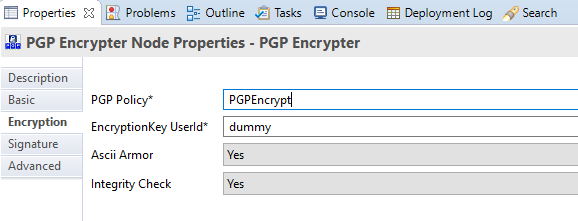
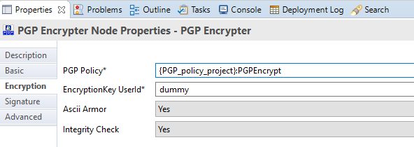

PGP SupportPac for App Connect Enterprise
======================================================

About
-----
Since ACE doesn't support Configurable Services anymore, the plugin has been reworked to reflect these changes.
The underlying code has been changed to get it functional again.
 - Connection with BrokerProxy has been removed
 - Policies are directly accessed via ```MbPolicy mbPol = getPolicy("UserDefined", getPgpPolicy());```

All references to Configurable Services (comments, name, variables) have been replaced by Policy or Policies.

Because of this rework, you will need to readd/reconfigure these nodes in your message flow(s) and redeploy the flow(s).   

Attention points
----------------
Since ACE requires all Policies to be defined in a Policy project, you need to either define a default Policy project
or you need to supply the Policy project name along with the PGP Policy name.
 - default Policy project:


 - dedicated Policy project:




Installation
------------
**Runtime:**
If you have configured the node to use a dedicated lilPath, copy the com.ibm.broker.supportpac.PGP.jar from .\lib to 
that directory, else copy com.ibm.broker.supportpac.PGP.jar from .\lib to %MQSI_BASE_FILEPATH%\server\jplugin for 
windows or to $MQSI_BASE_FILEPATH/server/jplugin for linux.
The supporting classes (bc*.jar) need to be copied to the %MQSI_REGISTRY%\shared-classes folder.

**Toolkit:**
Copy the contents from ./plugins to %MQSI_BASE_FILEPATH%\tools\plugins for windows or to
$MQSI_BASE_FILEPATH/tools/plugins for linux